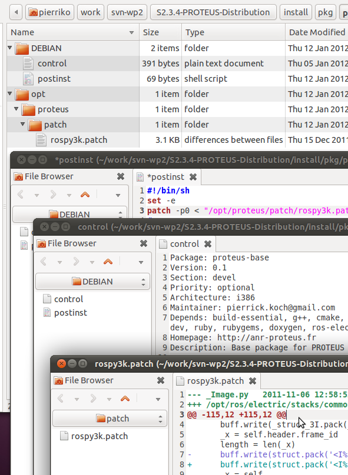
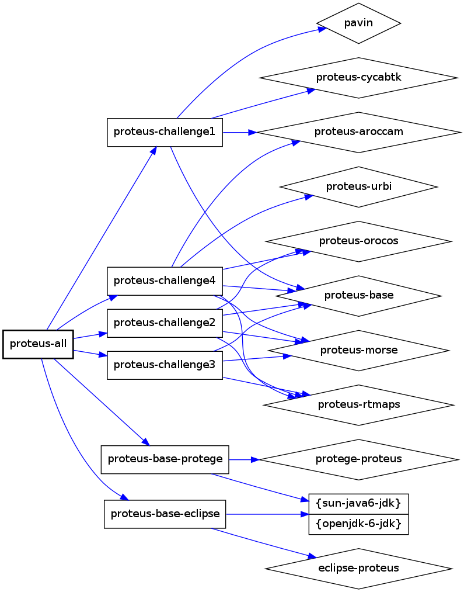
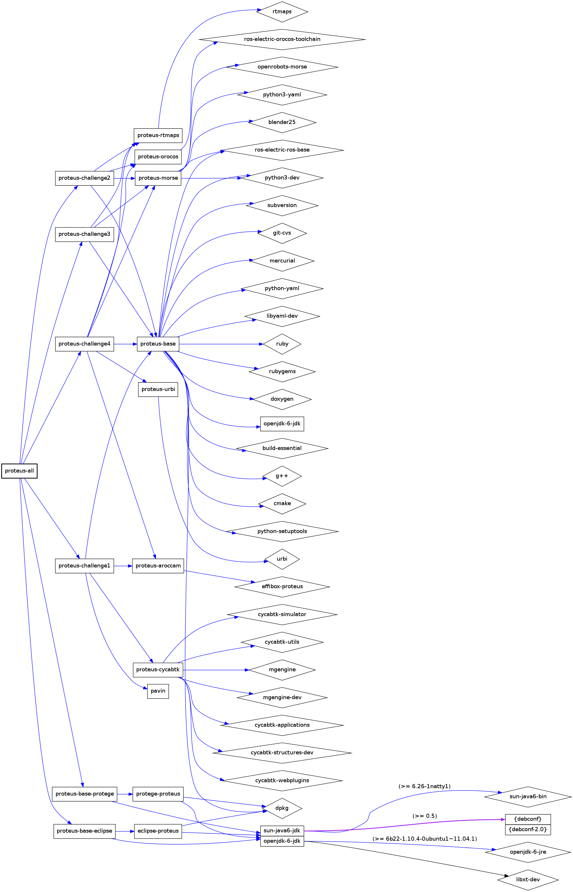

PROTEUS Packaging
=================

DEBIAN folder
-------------

mendatory

### control file

mendatory

### postinst file

optionnal, executed after installing the package

reprepro tool
-------------

Create debian repository:

    repo=path/to/debian/repository

    mkdir -p $repo/conf
    cat > $repo/conf/distributions << EOF
    Origin: Proteus
    Label: Proteus
    Suite: stable
    Codename: stable
    Version: all
    Architectures: i386
    Components: main
    Description: Proteus repository
    EOF

Create debian package:

    name=proteus-all # folder / software name
    package=$name.deb # file name (.deb)
    fakeroot dpkg -b $name $package

Include a package in the repository:

    reprepro -S main -P optional -Vb $repo includedeb stable $package

Remove a package in the repository:

    reprepro -Vb $repo remove stable $name

see: `../install/pkg/pkg.sh`

debtree
-------

TBD

